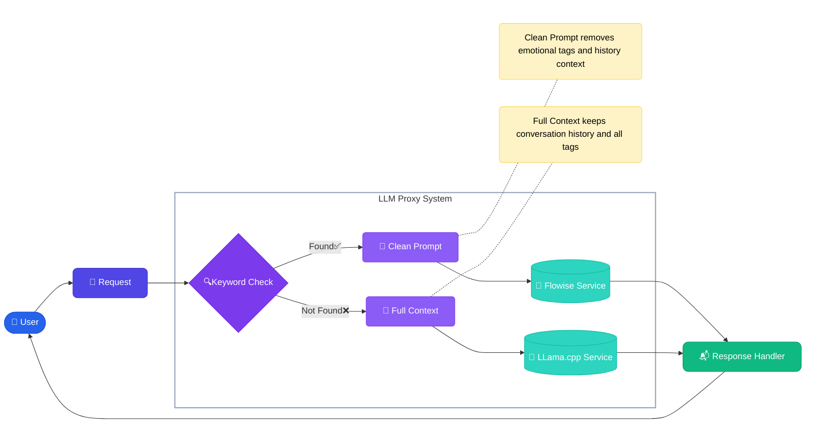

# LLM Proxy with Keywords Management GUI

### Architecture / Architektura

#### Flow Diagram / Schemat przepływu


**[EN]**  
The diagram shows the main flow of the application:
1. User sends a request
2. System checks for keywords
3. If keywords are found, the request is cleaned and sent to Flowise
4. If no keywords are found, the full context is sent to LLama.cpp
5. Response is returned to the user

**[PL]**  
Diagram pokazuje główny przepływ w aplikacji:
1. Użytkownik wysyła zapytanie
2. System sprawdza słowa kluczowe
3. Jeśli znaleziono słowa kluczowe, zapytanie jest czyszczone i wysyłane do Flowise
4. Jeśli nie znaleziono słów kluczowych, pełny kontekst jest wysyłany do LLama.cpp
5. Odpowiedź jest zwracana do użytkownika

[English](#english) | [Polski](#polski)

---
<a name="english"></a>
## English

### Table of Contents
- [About](#about)
- [Key Features](#key-features)
- [Requirements](#requirements)
- [Installation](#installation)
- [Usage](#usage)
- [Architecture](#architecture)
- [Troubleshooting](#troubleshooting)
- [License Information](#license-information)
- [Contributing](#contributing)

### About
LLM Proxy is a tool that enables intelligent request routing between llama.cpp and Flowise based on keywords. It features a simple web interface for managing routing rules and provides a seamless integration layer between different LLM services.

### Key Features
- Intelligent request routing between llama.cpp and Flowise
- Web-based keyword management interface
- Conversation context preservation for llama.cpp
- Context isolation for Flowise requests
- Automatic removal of emotion tags [xxx] for Flowise
- Persistent configuration storage in SQLite
- Full Docker containerization
- Support for streaming responses
- Multi-language support

### Requirements
- Docker and Docker Compose
- Running llama.cpp server
- Running Flowise server
- Python 3.9+
- 2GB RAM minimum
- 10GB disk space

### Installation
1. Clone the repository
```bash
git clone https://github.com/PPTG/llm-proxy-llamacpp-flowise.git
cd llm-proxy-llamacpp-flowise
```

2. Configure environment variables in docker-compose.yml
```yaml
environment:
  - LLAMA_URL=http://your-llama-server:8988
  - FLOWISE_URL=http://your-flowise-server:3000
```

3. Create environment file
```bash
cp .env.example .env
# Edit .env with your settings
```

4. Run the application
```bash
docker compose up --build
```

5. Verify installation
```bash
curl http://localhost:8444/health
```

### Usage

#### Available Endpoints
- GUI: `http://localhost:5555` - keyword management interface
- API: `http://localhost:8444` - proxy endpoints for llama.cpp and Flowise

#### API Documentation
All endpoints with examples:

##### Adding a keyword
```bash
curl -X POST http://localhost:8444/api/keywords \
  -H "Content-Type: application/json" \
  -d '{
    "keyword": "temperature",
    "flowise_id": "your-flow-id",
    "description": "Temperature query"
  }'
```

##### Sending a query
```bash
curl -X POST http://localhost:8444/api/chat \
  -H "Content-Type: application/json" \
  -d '{
    "messages": [
      {
        "role": "user",
        "content": "What is the temperature?"
      }
    ]
  }'
```

#### GUI Management
1. Open `http://localhost:5555` in your browser
2. Navigate to the keyword management section
3. Add, edit, or delete keywords
4. Each keyword requires:
   - Detection phrase
   - Flowise flow ID
   - Optional description
   - Optional active/inactive status
### Architecture

#### Project Structure
```
/
├── app.py            # Main FastAPI application file
├── gui.py           # Flask application for web interface
├── requirements.txt  # Python dependencies
├── Dockerfile       # Docker image configuration
├── docker-compose.yml # Services configuration
├── tests/           # Test suite
├── docs/           # Additional documentation
└── templates/       # HTML templates for GUI
    └── index.html   # Main interface template
```

#### How it Works
1. Request Processing:
   - System receives incoming request
   - Extracts the latest query from conversation context
   - Removes emotion tags if present
   - Checks for keyword matches

2. Routing Logic:
   - If keyword match found:
     * Forwards clean query to Flowise
     * Returns streaming response
   - If no match found:
     * Forwards full context to llama.cpp
     * Maintains conversation history

3. Response Handling:
   - Handles streaming responses
   - Manages error states
   - Ensures consistent format

### Troubleshooting

#### Common Issues
1. Connection Errors
   - Check if services are running
   - Verify URLs in configuration
   - Ensure network connectivity
   - Check firewall settings

2. Database Issues
   - Check /data directory permissions
   - Verify Docker volume mounting
   - Ensure SQLite is working properly

3. Performance Issues
   - Monitor memory usage
   - Check system resources
   - Verify connection speeds

#### Debug Mode
To enable debug mode:
```bash
docker compose -f docker-compose.debug.yml up
```

#### Logs
Access logs via:
```bash
docker compose logs -f
```

<a name="polski"></a>
## Polski

### Spis treści
- [O projekcie](#o-projekcie)
- [Główne funkcje](#główne-funkcje)
- [Wymagania](#wymagania)
- [Instalacja](#instalacja)
- [Użytkowanie](#użytkowanie)
- [Architektura](#architektura)
- [Rozwiązywanie problemów](#rozwiązywanie-problemów)
- [Informacje o licencji](#informacje-o-licencji)
- [Współpraca](#współpraca)

### O projekcie
LLM Proxy to narzędzie umożliwiające inteligentne przekierowywanie zapytań między llama.cpp a Flowise na podstawie słów kluczowych. Wyposażone jest w prosty interfejs webowy do zarządzania regułami przekierowań oraz zapewnia płynną integrację między różnymi usługami LLM.

### Główne funkcje
- Inteligentne przekierowywanie zapytań między llama.cpp a Flowise
- Interfejs webowy do zarządzania słowami kluczowymi
- Zachowanie kontekstu rozmowy dla llama.cpp
- Izolacja kontekstu dla zapytań do Flowise
- Automatyczne usuwanie znaczników emocji [xxx] dla Flowise
- Persystentne przechowywanie konfiguracji w SQLite
- Pełna konteneryzacja w Docker
- Obsługa odpowiedzi strumieniowych
- Wsparcie dla wielu języków

### Wymagania
- Docker i Docker Compose
- Działający serwer llama.cpp
- Działający serwer Flowise
- Python 3.9+
- Minimum 2GB RAM
- 10GB przestrzeni dyskowej

### Instalacja
1. Sklonuj repozytorium
```bash
git clone https://github.com/PPTG/llm-proxy-llamacpp-flowise.git
cd llm-proxy-llamacpp-flowise
```

2. Skonfiguruj zmienne środowiskowe w docker-compose.yml
```yaml
environment:
  - LLAMA_URL=http://your-llama-server:8988
  - FLOWISE_URL=http://your-flowise-server:3000
```

3. Utwórz plik środowiskowy
```bash
cp .env.example .env
# Edytuj .env zgodnie z twoimi ustawieniami
```

4. Uruchom aplikację
```bash
docker compose up --build
```

5. Zweryfikuj instalację
```bash
curl http://localhost:8444/health
```

### Użytkowanie

#### Dostępne endpointy
- GUI: `http://localhost:5555` - interfejs zarządzania słowami kluczowymi
- API: `http://localhost:8444` - endpointy proxy dla llama.cpp i Flowise

#### Dokumentacja API
Wszystkie endpointy z przykładami:

##### Dodawanie słowa kluczowego
```bash
curl -X POST http://localhost:8444/api/keywords \
  -H "Content-Type: application/json" \
  -d '{
    "keyword": "temperatura",
    "flowise_id": "your-flow-id",
    "description": "Zapytanie o temperaturę"
  }'
```

##### Wysyłanie zapytania
```bash
curl -X POST http://localhost:8444/api/chat \
  -H "Content-Type: application/json" \
  -d '{
    "messages": [
      {
        "role": "user",
        "content": "Jaka jest temperatura?"
      }
    ]
  }'
```

### Architektura

#### Struktura projektu
```
/
├── app.py            # Główny plik aplikacji FastAPI
├── gui.py           # Aplikacja Flask do interfejsu webowego
├── requirements.txt  # Zależności Pythona
├── Dockerfile       # Konfiguracja obrazu Docker
├── docker-compose.yml # Konfiguracja usług
├── tests/           # Testy
├── docs/           # Dodatkowa dokumentacja
└── templates/       # Szablony HTML dla GUI
    └── index.html   # Główny szablon interfejsu
```

#### Jak to działa
1. Przetwarzanie zapytań:
   - System otrzymuje przychodzące zapytanie
   - Wyodrębnia najnowsze zapytanie z kontekstu rozmowy
   - Usuwa znaczniki emocji, jeśli występują
   - Sprawdza dopasowania słów kluczowych

2. Logika routingu:
   - Jeśli znaleziono dopasowanie słowa kluczowego:
     * Przekazuje oczyszczone zapytanie do Flowise
     * Zwraca odpowiedź strumieniową
   - Jeśli nie znaleziono dopasowania:
     * Przekazuje pełny kontekst do llama.cpp
     * Zachowuje historię rozmowy

### Rozwiązywanie problemów

#### Częste problemy
1. Błędy połączenia
   - Sprawdź czy usługi są uruchomione
   - Zweryfikuj adresy URL w konfiguracji
   - Upewnij się, że jest połączenie sieciowe
   - Sprawdź ustawienia firewalla

2. Problemy z bazą danych
   - Sprawdź uprawnienia katalogu /data
   - Zweryfikuj montowanie wolumenu Docker
   - Upewnij się, że SQLite działa prawidłowo

3. Problemy z wydajnością
   - Monitoruj użycie pamięci
   - Sprawdź zasoby systemowe
   - Zweryfikuj prędkości połączeń

#### Tryb debugowania
Aby włączyć tryb debugowania:
```bash
docker compose -f docker-compose.debug.yml up
```

#### Logi
Dostęp do logów:
```bash
docker compose logs -f
```

---
<a name="license-information"></a>
## License Information / Informacje o licencjach

### Project License / Licencja projektu
Apache License 2.0

### Third Party Licenses / Licencje komponentów zewnętrznych

This project uses several third-party libraries and components, each with its own license:

| Component | License | Usage |
|-----------|---------|-------|
| llama.cpp | MIT License | Large Language Model backend |
| Flowise | Apache License 2.0 | Flow-based automation |
| FastAPI | MIT License | Main API framework |
| Flask | BSD License | Web GUI framework |
| httpx | BSD License | HTTP client |
| SQLite | Public Domain | Database |
| Pydantic | MIT License | Data validation |
| uvicorn | BSD License | ASGI server |

Full license text can be found in the LICENSE file in the repository.

## Contributing / Współpraca
We welcome contributions! Please see our Contributing Guidelines for details.
Zapraszamy do współpracy! Szczegóły znajdują się w Wytycznych dla Współtwórców.

---

Created with ❤️ by PPTG


